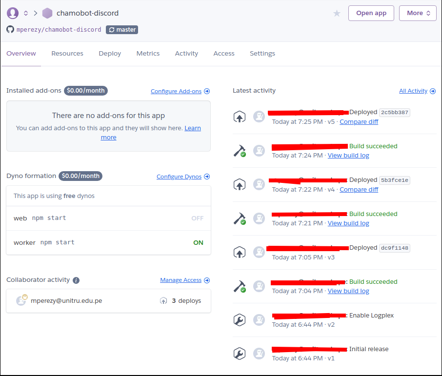

# Bot de chat para un servidor de chat en Discord

## Requerimientos
* Conocimientos básicos en Javascript
* [**Docker**](https://docs.docker.com/install/linux/docker-ce/ubuntu/)
* [**Docker Compose**](https://docs.docker.com/compose/install/) (Este script fue ejecutado usando Ubuntu, si cuentas con otros S.O., instala Docker y
Docker Compose según corresponda tu S.O.)
* Editor de Texto como **VSCode** o un IDE como **Webstorm**
* Contar con una cuenta en [**Heroku**](https://id.heroku.com/login) para poder deployarlo y esté disponible "siempre", y tenerlo instalado en el ordenador.
* [**Git**](https://git-scm.com/download/linux)

## ¿Cómo instalarlo?

* Una ver logeados con nuestro perfil de Discord, ingresar a: https://discordapp.com/developers/applications, y hacer click en *Nueva Aplicación* o *New Application*:
    
    

* Ahora tenemos asignar nuestro bot creado a un servidor de chat ya creado previamente:
    
    
    
    Consederemos permisos de *Administrador* a nuestro bot:
    
    
    
    
    
    Resolvemos el captcha
    
    
    
    
    
* Lo que sigue ahora es copiar el token y pegarlo en archivo `src/index.js` para que el script pueda conectarse con el API de Discord y tan fácil cómo
  darle click al botón de *Copy*:
  
    

## Ejecutándo el bot desde nuestro computador

* Si deseamos ejecutar el bot creado desde nuestro ordenador será tan simple como ejecutar en nuestra terminal:
    ```
    $ docker-compose up
    ```
    
    Y veremos que todo debería estar funcionando bien:
    
    
* Accediendo a Discord y el servidor creado, probaremos nuestro bot en cualquier chat de texto:

    
    
* Si desearamos detener el bot simplemente tendríamos que presional *Ctrl* + *C*:

    
    
## Ejecutándo el bot de forma permanente deployandolo a **Heroku**

* Para ello debemos debemos crear una nueva app en Heroku:

    
    
    Aquí me sale *not available* porque ya tengo una app creada con ese nombre
    
    
    
    Teniendo ya creado la app, tendremos que seguir los pasos que siguen:
    
    
    
    Puedes deployar el bot directamente a un repo que *Heroku* manejará
    
    
    
    O usar un propio repo que tú tengas guardado en tu perfil de *Github*
    
    
    
    Lo que nos quedaría por hacer es buscar nuestro repo en el buscador que nos proporciona *Heroku* y conectar con la repo
    
    
    
    Una vez conetada para que se deploye, podríamos hacerlo de forma manual haciendo click en *Deploy branch* en el apartado *Manual deploys*,
    o también se podría deployar de forma automática cada vez que hagamos *push* al branch **master** de nuestro repo haciendo click en
    *Enable Automatic Deploys*.
    
    
    
    
    
    En la pestaña *Overview* podemos ver el estado del deploy según vayamos haciendo push al repo o deployando de forma manual.
    
    
    
    Y listo!!, ya tendríamos ejecutándose nuestro bot en Discord cómo si se estuviera ejecutado desde nuestro ordenador.
    
     